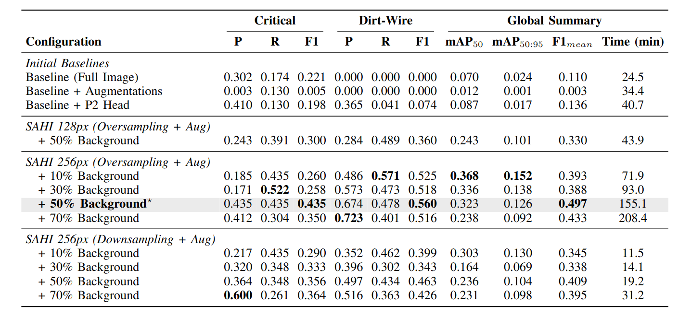
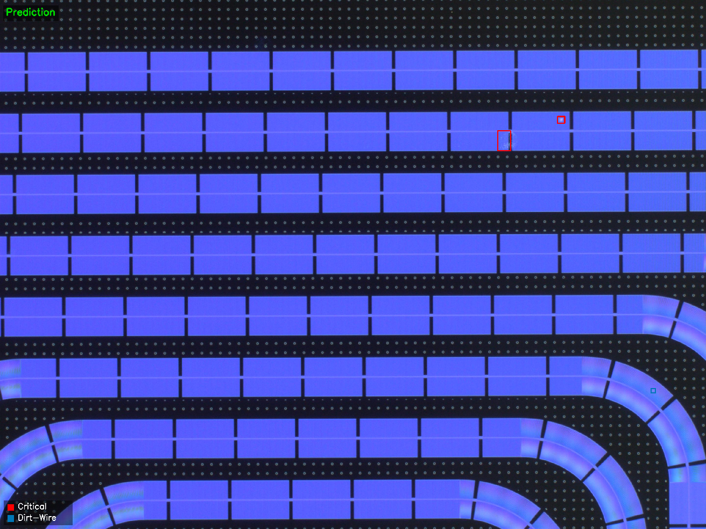

# Superconducting Defect Detection (YOLO11 + SAHI)

Detecting microscopic fabrication defects on superconducting wafers. We target two defect types, Critical and Dirt-Wire, using a YOLO11 detector enhanced with SAHI slicing to recover small-object recall. The pipeline includes label standardization (Label Studio), class/background rebalancing, SAHI tiling, and stitched full-image evaluation to approximate deployment conditions. Tested on Ubuntu 24.04 LTS (x86_64) in a VM with Python 3.12.3, Pip 24.0, and an NVIDIA GeForce RTX 4060 (8 GB VRAM).


## Results Snapshot

**Metrics (val split)**



- Best config: SAHI 256px, oversampling, +50% background → F1_mean 0.497; Critical F1 0.435, Dirt-Wire F1 0.560; mAP50 0.323; mAP50:95 0.126; ~155 min/150 epochs.
- SAHI + background balancing significantly boosts recall vs. full-image baselines; smaller slices (128px) improve recall but at lower precision; downsampling trades speed for slightly lower F1.
- P2 head alone helps small objects but we needed slicing + balancing to generalize.

**Visual examples**
- Defect detection prediction (Critical in red, Dirt-Wire in cyan): 2 Criticals and 1 Dirt-Wire were found. (running `src/inference.py`)


## Approach overview
- Data & labeling: NDA-limited subset released ([datasets/full_dataset](datasets/full_dataset), [datasets/labeling_output](datasets/labeling_output)); labels standardized in Label Studio, exported YOLO, processed via pipeline (split → COCO ↔ YOLO → SAHI slicing → class/background balancing).
- Model: YOLO11 with optional P2 head; SAHI for small-defect recall; background tiles tuned (10–70%) to mitigate bias toward empty slices.
- Training: on SAHI-sliced YOLO data (default best weights at [src/models/best_model/weights/best.pt](src/models/best_model/weights/best.pt)).
- Evaluation: standard YOLO val (`eval.py`) plus stitched full-image SAHI eval (`eval-sahi.py`) for deployment-like metrics (mAP, F1, confusion, visuals).
- Inference: CLI (`inference.py`) and Streamlit web demo (`inference-web.py`) with slicing controls and run selection.

## Quickstart
1) **Set up env**
```bash
python3 -m venv env
source env/bin/activate
pip install -r requirements.txt
```

2) **Preprocess data (tiling + balancing)**
```bash
cd datasets/dataset-preprocessing
python3 run_pipeline.py \
	--actions prepare_labels_and_split yolo_to_coco slice_coco coco_to_yolo balance_classes_upsample balance_backgrounds \
	--labels-root ../labeling_output \
	--images-root ../full_dataset \
	--split-ratios 0.8 0.2 \
	--slice-height 256 --slice-width 256 --slice-overlap 0.2 \
	--background-target 0.50 \
	--output-dir ../processed_dataset \
	--clean-targets
cd ../..
```

3) **Train (YOLO11 + SAHI-ready slices)**
```bash
cd src
python3 train.py
```
Outputs under [models/<run>/weights/](models) (YOLO run folders); default best at [models/best_model/weights/best.pt](models/best_model/weights/best.pt).

4) **Evaluate**
- YOLO eval: `python3 eval.py --weights models/best_model/weights/best.pt`
- SAHI eval (global metrics):
```bash
python3 eval-sahi.py \
	--weights models/best_model/weights/best.pt \
	--split val \
	--data_root ../datasets/train_val_dataset
```

5) **Inference**
- CLI sliced inference demo: `python3 inference.py`
- Streamlit UI: `streamlit run inference-web.py`

## Data & NDA note
We provide an NDA-compliant subset: [datasets/full_dataset](datasets/full_dataset) (images) and [datasets/labeling_output](datasets/labeling_output) (annotations). Processed datasets live in [datasets/processed_dataset](datasets/processed_dataset) and [datasets/train_val_dataset](datasets/train_val_dataset) after running the pipeline. Raw proprietary data beyond this subset is not distributed.

## Repository map
Each folder has its own README with details.
- Data: [datasets](datasets/README.md)
- Preprocessing pipeline: [datasets/dataset-preprocessing](datasets/dataset-preprocessing/README.md)
- Labeling workflow + ML backend: [labeling](labeling/README.md) and [labeling/model_backend](labeling/model_backend/README.md)
- Training / eval / inference: [src](src/README.md)
- Methodology notes: [docs/methodology.md](docs/methodology.md)

## Problem statement (high level)
Goal: detect superconducting fabrication defects (Critical, Dirt-Wire) in wafer imagery. The model uses YOLO11 with optional P2 head and SAHI slicing to improve small-defect recall. We balance background tiles, upsample minority classes, and evaluate on stitched full-image metrics to approximate real-world deployment.
